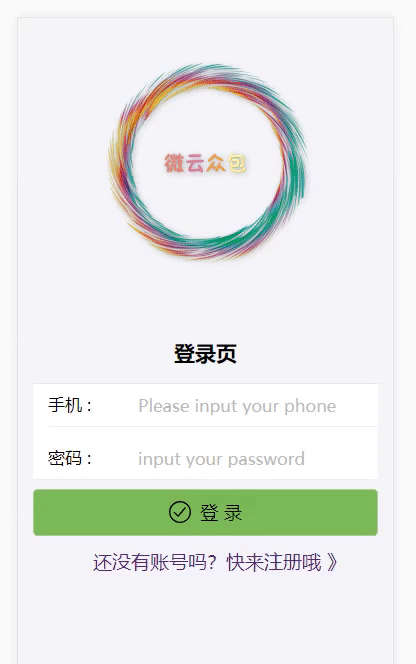
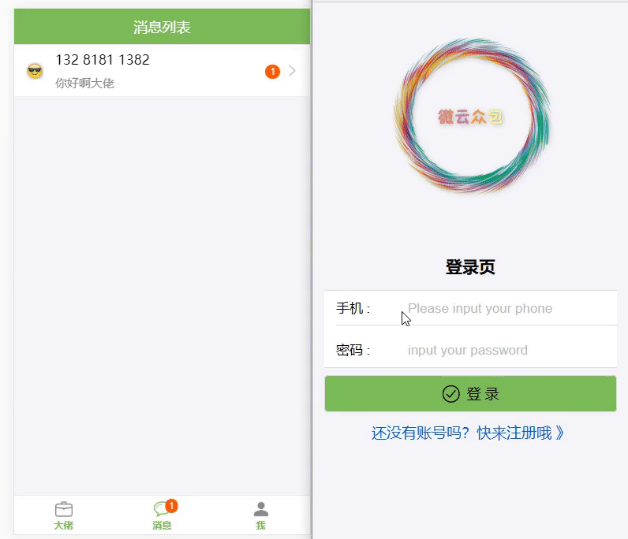
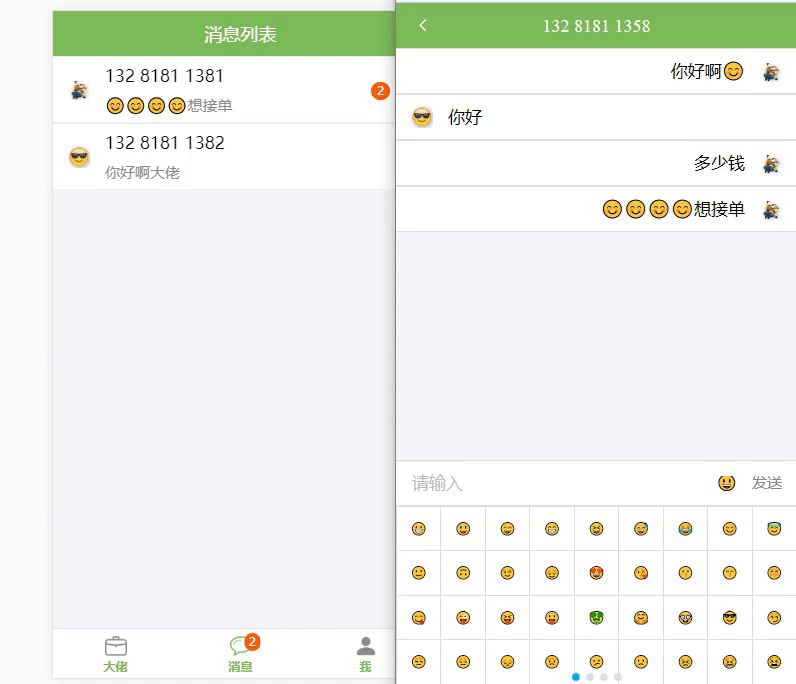

# 微云众包--在线接单外包系统

## 技术栈和主要框架

📦 React 全家桶：react + redux + react-router (4.3)

📌 ES6 + ES7 + Babel 7

📡 网络请求：axios + socket.io 

🎈 页面相应式框架：antd mobile(2.2.6)

✏️ 后台：express + mongoDB

## 项目运行（nodejs 8.9+）
``` bash
# 克隆到本地
git clone https://github.com/KieSun/Chat-Buy-React.git
cd chat-buy-react

# Mac 安装MongoDb (如果命令行因为网络问题安装不了，可以直接去 https://www.mongodb.com/download-center#community 下载
brew install mongodb

# Windows 安装MongoDb 直接官网下载安装

# 启动MongoDb（安装成功后命令行有提示 下面演示windows）
mongod --dbpath=xxx

# 安装依赖
npm install

# 全局安装 nodemon 
npm i nodemon -g

# 开启后端 (进入server目录)
nodemon server.js


# 开启本地服务器
npm start

# 发布环境
npm run build
```

## 项目预览
~~https://money.aemple.top~~ (服务器到期，无法预览了)
### 预览图





## 项目目录

        ├── README.md
        ├── config               // 开发环境的配置
        ├── public
        │   ├── index.html       // 项目页面入口文件
        ├── package.json         // 项目配置文件
        ├── scripts              // npm scrips 命令配置
        ├── server               // 后端配置
        │   ├── server.js        // 服务启动文件
        │   ├── model.js         // 数据库配置
        │   ├── userRoute.js     // 接口配置    
        ├── src
        │   ├── components       // 所有组件
        │   ├── container        // 所有页面
        │   ├── redux            // redux管理
        │   ├── config.js	     // axios拦截
        │   ├── index.js         // 入口文件
        │   ├── index.css        // 页面样式
        │   ├── util.js          // 功能函数封装
        │   └── reducer.js       // 所有reducer合并

## 实现的功能
- [√] 项目按路由模块加载
- [√] 登录注册，以及登录权限控制
- [√] 信息完善页面
- [√] 外包项目页面
- [√] 我的页面
- [√] 聊天功能
- [√] 项目部署
- [√] Https加密访问链接

**未来计划**
- [] TypeScript 替换 JS
- [] 后端实现 GraphQL

## 项目部署
在部署项目这块使用了pm2来管理我们的node应用,使用nginx进行反向代理，将默认80端口指向了node项目端口，然后node服务端添加中间件进行路由拦截.

**Https加密**链接使用了Let’ s Encrypt 提供的免费 SSL 证书，使用 acme.sh 安装，使用acme.sh来申请和管理证书，它很简单用，还能够利用**crontab自动更新证书**，而且是默认就有的功能。

下面是我的步骤以及配置（具体请参考https://github.com/Neilpang/acme.sh）

```
1、安装
curl  https://get.acme.sh | sh

安装完之后，可以退出登录，再重新登录，或者执行一下source ~/.bashrc
之后就可以使用acme.sh命令了

 2、申请证书
acme.sh --issue -d money.aemple.top -w /home/Pig-outsourcing

3、将证书安装到应用中
acme.sh --installcert -d money.aemple.top \
               --keypath       /home/ssl/money.aemple.top.key  \
               --fullchainpath /home/ssl/money.aemple.top.key.pem \
               --reloadcmd     "sudo nginx -s reload"

4、接下来，还需要再生成一个文件，具体我也不知道有什么用，很多ssl的配置都需要它
openssl dhparam -out /home/ssl/money.aemple.top.dhparam.pem 2048

5、nginx配置
ssl_certificate         /home/ssl/money.aemple.top.key.pem;
ssl_certificate_key     /home/ssl/money.aemple.top.key;
ssl_dhparam             /home/ssl/money.aemple.top.dhparam.pem;


顶层的http指令那里，也需要加上这两行： sudo vim /etc/nginx/nginx.conf

http {
    ssl_protocols TLSv1 TLSv1.1 TLSv1.2;
    ssl_prefer_server_ciphers on;
} 

最后，把nginx重启一下，就能看到效果啦
```
## 个人总结

vscode装饰器报错问题解决  https://blog.csdn.net/yiifaa/article/details/78862507

babel 7的装饰器支持发生变化,官方文档有示例（遇到错误先看官网，网上的不一定和你的一样）

webpack跨域代理配置

antd-mobile 按需加载优化性能 官网实例

浏览器调试工具使用
http://extension.remotedev.io/#usage

axios拦截器配置优化用户体验（显示loding）


## ❗️ 勘误antd-mobile 按需加载 官网实例


如果在项目中发现了有什么不解或者发现了 bug，欢迎提交 PR 或者 issue.

## ♥️ 感谢

如果喜欢这个项目，欢迎 Star！